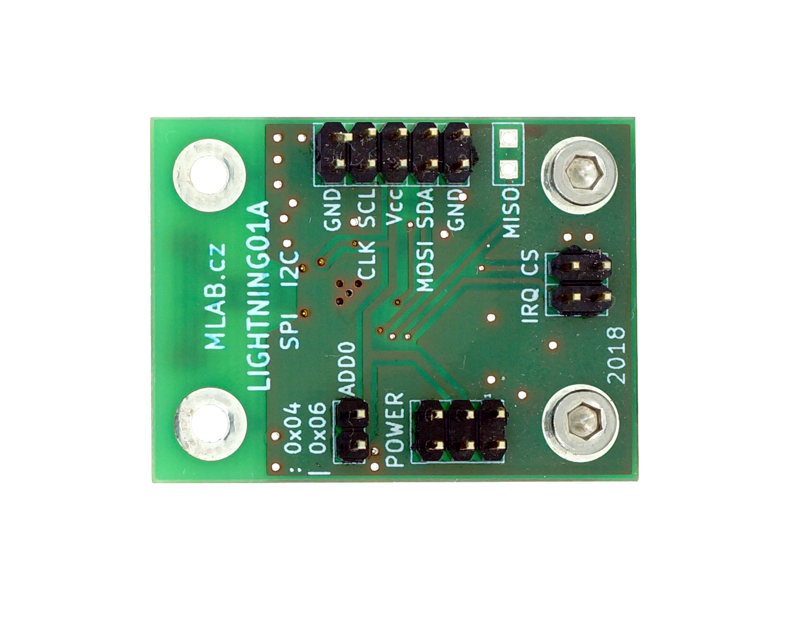

# LIGHTNING01A

## Digital lightning sensor

Lightning sensor module based on [AS3935](https://cz.mouser.com/pdfdocs/AMS_AS3935_Datasheet_v4.pdf) Franklin Lightning Sensor IO. Sensor can be connected via I2C or SPI bus.
 
